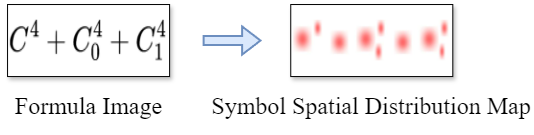
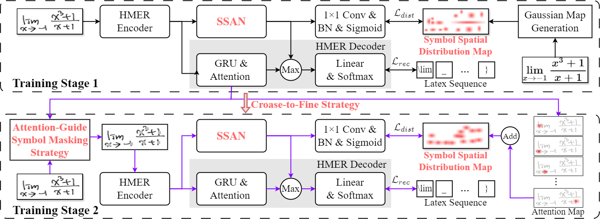
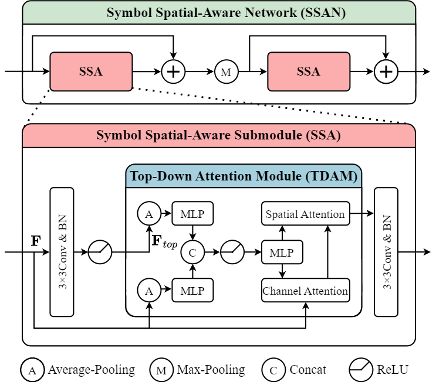

# SSAN: A Symbol Spatial-Aware Network for Handwritten Mathematical Expression Recognition

## The Proposed Auxiliary Task

<p align="left"></p>

We propose a novel auxiliary task that predicts the symbol spatial distribution map to enhance the HMER model perception 
and understanding of the structure of formula images. 

The **code** for generating the symbol spatial distribution map can 
be found in the `get_gaussian` function of `utils.py`.


## Overview Architecture

<p align="left"></p>

The overall end-to-end trainable architecture aims to jointly optimize 
the **S**ymbol **S**patial-**A**ware **N**etwork (SSAN) 
and the HMER model within a multi-task framework.

The **code** for integrating SSAN with the baseline model can be found 
in `models/SSAN_DWAP.py`, `models/SSAN_SAM_DWAP`, and `models/SSAN_CAN_DWAP.py`.

## Symbol Spatial-Aware Network

<p align="left"></p>

The architecture of the SSAN, 
consisting of two symbol spatial-aware submodels.

## Requirements

- cudatoolkit=11.3.1
- cudnn=8.2.1
- numpy=1.21.5
- opencv=4.4.0
- python = 3.7.13
- pytorch=1.12.1
- scikit-image=0.16.2
- scikit-learn=1.0.2
- yaml=0.2.5

## Prepare Dataset

We train SSAN-DWAP and SSAN-CAN-DWAP using the CROHME 2014 training set and evaluate these models on the CROHME 2014, CROHME 2016, and CROHME2019.

You can execute the `dataset.py` script to generate NPY dataset files.

For generating printed templates of handwritten mathematical
expression images, please use the following commands:

```bash
sudo apt-get install miktex
miktexsetup finish
initexmf --set-config-value [MPM]AutoInstall=1

sudo apt install texlive-xetex
sudo apt-get install imagemagick

python gen_printed_img.py
```

## Training

Please check `config.yaml` before training the SSAN-DWAP or SSAN-CAN-DWAP:
```yaml
model: 'SSAN_DWAP'  # SSAN_DWAP or SSAN_CAN_DWAP

epochs: 240
batch_size: 12

train_image_path: '/path/to/train_dataset'  # need NPY file
eval_image_path: '/path/to/test_dataset'  # need NPY file
alphabet_path: '/path/to/alphabet'
```

Then, you can start the training by
```bash
# Using DDP to train the model on 2 NVIDIA V100 32GB gpus
torchrun --nproc_per_node=2 --master_port=28000 --nnodes=1 train.py --cfg config.yaml
```

## Testing

When testing SSAN-DWAP or SSAN-CAN-DWAP, please fill in the `checkpoint` with the checkpoint path in the `config.yaml` or use `--cp` bash command:
```bash
python test.py --gpu 0 --model SSAN-DWAP --cp ./checkpoints/best_model.pth
```

The model weight files of SSAN_DWAP, SSAN_SAM_DWAP, and SSAN_CAN_DWAP can be download 
from [Google Drive](https://drive.google.com/drive/folders/1gB9neN-ElioPcrZabH8gd2ZK7F41xD8b?usp=sharing).

## Acknowledgment

We thank the teams of [CAN (ECCV 2022)](https://github.com/LBH1024/CAN) and
[TDAM (ECCV 2022)](https://github.com/shantanuj/TDAM_Top_down_attention_module) 
for sharing their work as open source, which our code builds upon.
